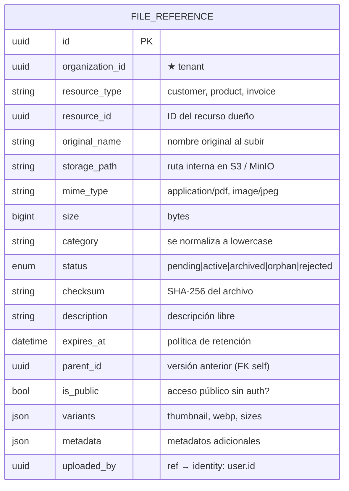
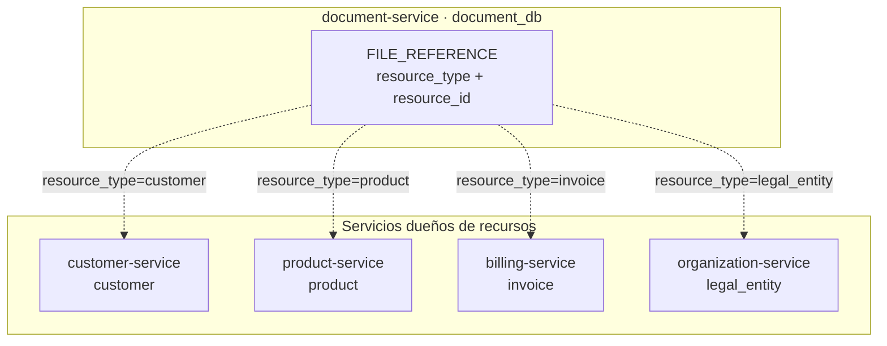
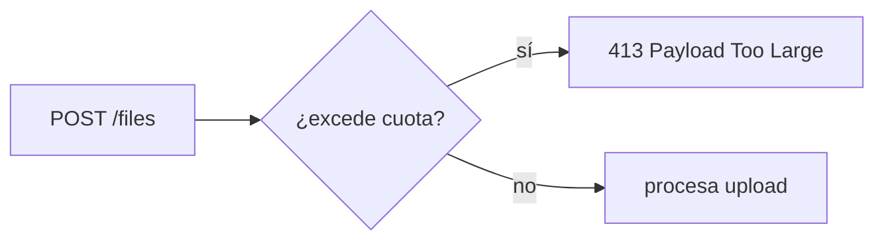
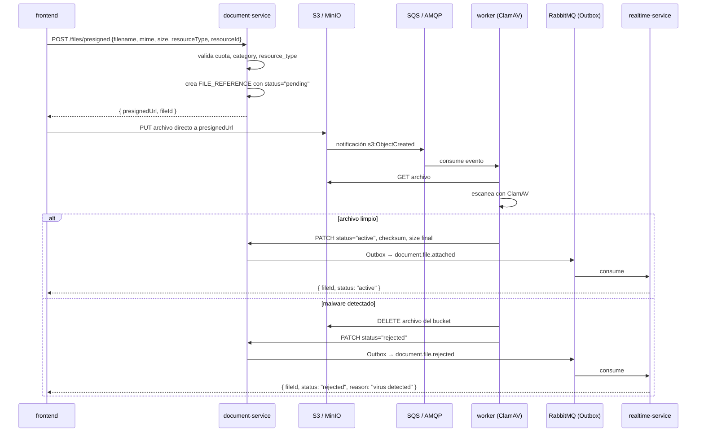
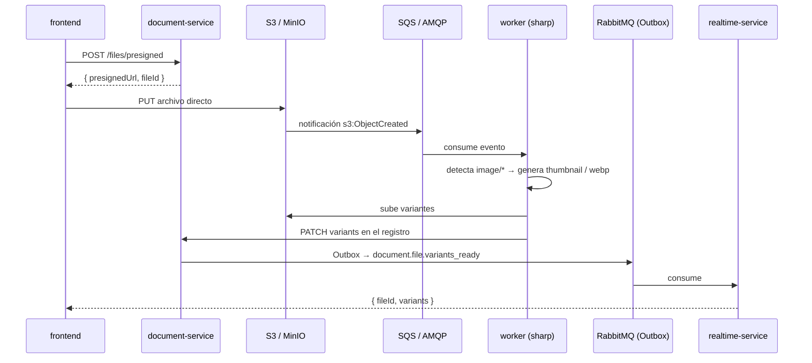

# document-service

Servicio de **almacenamiento y gestión de archivos** del ecosistema CRM. Dueño de todos los archivos adjuntos del sistema: imágenes, PDFs, XMLs de comprobantes electrónicos y documentos genéricos. La asociación con las entidades dueñas es **polimórfica** (un archivo puede pertenecer a cualquier tipo de recurso).

> **Alcance de este documento:** análisis y diseño del servicio.

---

## Stack tecnológico

| Capa | Tecnología | Notas |
|------|------------|-------|
| Runtime | Node.js ≥ 20 | LTS |
| Lenguaje | TypeScript | `strict: true` |
| HTTP | Hono.js | framework web |
| ORM | none (solo metadatos en SQL) | Sequelize opcional |
| Base de datos | MySQL ≥ 8 | base propia: `document_db` |
| Storage | S3 / MinIO / disco local | configurable por entorno |
| Procesamiento imágenes | Sharp | generación de variantes (thumbnail, webp) |
| Validación | Zod + `@hono/zod-validator` | en el borde HTTP |
| Mensajería | RabbitMQ | eventos (Outbox) |
| Contenedores | Docker / K3s | despliegue |

---

## Responsabilidad

Responde a **"¿dónde está el archivo X y quién puede accederlo?"**. Administra solo los **metadatos** del archivo; el almacenamiento físico se delega a S3 / MinIO (o disco local en desarrollo). No tiene lógica de negocio sobre el contenido del archivo.

> El servicio no sabe qué es una factura ni un cliente. Solo sabe que existe un recurso de tipo `invoice` con ID `x` que tiene un archivo adjunto.

---

## Entidades dueñas (`document_db`)



> `FILE_REFERENCE` no tiene sub-entidades: cada fila es un archivo individual. Para agrupar archivos (ej. "fotos del producto X"), se filtra por `resource_type + resource_id`.

---

## Asociación polimórfica

Cualquier entidad del sistema puede tener archivos adjuntos sin acoplar su esquema a document-service:



Cada servicio dueño del recurso decide qué archivos mostrar/adjuntar. La consistencia se mantiene por **eventos de borrado**: cuando un recurso se elimina, publica un evento y document-service limpia sus archivos.

---

## Almacenamiento físico

| Entorno | Backend | Ruta de ejemplo |
|---------|---------|-----------------|
| Desarrollo | Disco local + PersistentVolumeClaim (K3s) | `./storage/{orgId}/{resourceType}/{fileId}` |
| Producción | S3 / MinIO | `s3://bucket/{orgId}/{resourceType}/{fileId}` |

Los archivos se almacenan con **nombre UUID** para evitar colisiones y path traversal. El nombre original se conserva solo en metadatos.

### Cuotas por organización

Cada organización tiene un límite de almacenamiento (configurable por env, default 1 GB). Se verifica antes de cada upload:



La cuota actual se calcula agregando `size` de todos los archivos `active` + `archived` de la organización.

### Direct-to-S3 con scan asíncrono

El frontend sube directo a S3 vía **URL pre-firmada**. El antivirus se ejecuta asíncrono mediante evento del bucket, sin pasar el binario por document-service:



Todos los archivos usan el mismo flujo async, sin importar el tamaño. En desarrollo local (sin S3/MinIO), el `POST /files` acepta multipart y el scan se ejecuta síncrono.

> **Nota de implementación:** el worker del scan consume de una cola separada. En AWS es SQS (notificación vía S3 → SNS → SQS). En MinIO es RabbitMQ/AMQP (notificación vía bucket → AMQP). Los eventos de dominio (`document.file.*`) siempre van por el Outbox (RabbitMQ).

### Variantes de imágenes

Para imágenes (`mime_type` empieza con `image/`), el servicio puede generar variantes (miniaturas, tamaños predefinidos) de forma asíncrona:



El frontend recibe respuesta inmediata con `status: "processing"` y las variantes llegan después por WebSocket (realtime-service). Como alternativa: **polling** a `GET /files/:id` hasta que `variants != null`.

---

## API REST

| Método | Ruta | Permiso | Descripción |
|--------|------|---------|-------------|
| GET | `/files?resourceType=&resourceId=&category=` | `document:read` | Lista archivos de un recurso |
| GET | `/files/:id` | `document:read` | Metadatos del archivo |
| GET | `/files/:id/download` | `document:read` | Descargar archivo binario |
| POST | `/files/presigned` | `document:create` | Solicitar URL pre-firmada para subir archivo |
| PATCH | `/files/:id` | `document:update` | Actualizar metadatos |
| DELETE | `/files/:id` | `document:delete` | Eliminar archivo |
| POST | `/files` | `document:create` | Subir archivo (multipart, solo dev/local) |

Todas filtran por `organizationId` del contexto.

> Las rutas `/download` pueden servir el archivo directamente si `is_public=true`, o requerir autenticación. Para archivos de facturas (PDF/XML autorizado), se sirven con un **token firmado** de acceso temporal (`?token=`).

---

## Eventos

### Publica

| Evento | Cuándo | Consumido por |
|--------|--------|---------------|
| `document.file.attached` | Archivo subido y vinculado a un recurso | realtime-service, servicios dueños (actualizan UI) |
| `document.file.removed` | Archivo eliminado | realtime-service, servicios dueños |
| `document.file.image_uploaded` | Imagen subida (dispara variantes) | Worker interno de document-service |

### Consume

| Evento | Origen | Acción |
|--------|--------|--------|
| `customer.customer.disabled` | customer-service | Marca archivos como `orphan` o elimina |
| `product.product.disabled` | product-service | Marca archivos como `orphan` |
| `billing.invoice.voided` | billing-service | (opcional) conserva archivos legales; no eliminar |

---

## Estados del archivo

| Estado | Significado | ¿Editable? | ¿Eliminable? |
|--------|-------------|:----------:|:------------:|
| `pending` | Subido a S3, esperando scan de antivirus | No | Sí |
| `active` | Archivo normal, scan pasado | Sí | Sí (por quien lo subió) |
| `archived` | Comprobante autorizado congelado | No | No |
| `orphan` | Recurso dueño eliminado | No | Programado (TTL) |
| `rejected` | Malware detectado en el scan | No | S3 ya lo eliminó |

---

## Validaciones

- **Borde (Zod)**:
  - `category` se normaliza a lowercase + trim. No se rechazan valores desconocidos (el servicio es abstracto).
  - Mime types permitidos según `category` (imagen: image/*; documento: application/pdf; comprobante: application/xml, application/pdf).
  - Tamaño máximo por archivo (10 MB general, 50 MB para comprobantes).
  - `resource_type` debe ser un tipo conocido del sistema (validado contra catálogo en código).
- **Dominio**:
  - `checksum` SHA-256 obligatorio para `category=comprobante` (integridad fiscal).
  - Un archivo con `resource_type=invoice` y `category=comprobante` no puede marcarse `is_public=true`.
  - `is_public=true` solo permitido para categorías sin contenido fiscal sensible (imagen, documento).
  - Los archivos de facturas emitidas no se pueden eliminar (inmutabilidad legal → solo `archived`).
  - No exceder la **cuota de almacenamiento por organización** (verificado antes de cada upload).
  - El `resource_id` debe existir en el servicio dueño (validación opcional vía evento de confirmación).

---

## Seguridad

- Los archivos se almacenan con nombre UUID (no el original) para evitar **path traversal** y colisiones.
- El acceso a `/download` verifica que el usuario tenga permiso sobre el `resource_type` y `resource_id`.
- Para acceso público (logo de organización), se usa `is_public=true` y se sirve vía CDN con cache largo.
- Los archivos de comprobantes fiscales se sirven con **token firmado** temporal (JWT corto, 5 min, firmado con clave del servicio, incluye `file_id` + `organization_id`).
- **`is_public` está prohibido** para `category=comprobante`. El dominio rechaza cualquier intento de marcar como público un archivo con contenido fiscal.
- **Virus scanning** con ClamAV en el upload: el archivo no se marca `active` hasta que pasa el scan.

---

## Dependencias

- **S3 / MinIO** (o sistema de archivos local): almacenamiento físico.
- **RabbitMQ**: eventos de dominio (Outbox).
- **identity-service**: para `uploaded_by` y resolución de permisos.

---

## Estructura de carpetas propuesta

```
src/
  config/
    config.ts
  domain/
    file-reference.ts
    value-objects/
      storage-config.ts
  application/
    ports.ts
    upload-file.ts
    download-file.ts
    list-files.ts
    delete-file.ts
  infrastructure/
    persistence/
      models/
      repositories/
    storage/           # adaptadores de almacenamiento físico
      local-storage.ts
      s3-storage.ts
    image-processing/  # sharp para variantes
      image-processor.ts
    config/
      config.ts
  interface/
    http/
      app.ts
      routes/
      controllers/
      schemas/
main.ts
```

---

## Notas de diseño

- Este servicio reemplaza el almacenamiento local de PDF/XML que billing-service podría hacer en fase 1. Desde fase 2, billing delega la persistencia y servir de archivos a document-service.
- `variants` (JSON) almacena rutas de versiones generadas: `{ thumbnail: "...", webp: "..." }`.
- La generación de variantes con **Sharp** se ejecuta en un worker asíncrono para no bloquear el upload.
- Los archivos `orphan` se limpian periódicamente con un **job de reconciliación** (configurable por TTL). Este mismo job verifica que no haya archivos huérfanos cuyo recurso dueño ya no existe (fallback ante eventos perdidos).
- **Virus scanning**: los archivos se escanean con ClamAV antes de marcarse como `active`. Si el scan falla o detecta malware, el archivo se elimina y se notifica al usuario.
- En K3s con disco local, se necesita un **PersistentVolumeClaim** para que los archivos sobrevivan reinicios del pod.
- `parent_id` permite **versionado**: al reemplazar un archivo (ej. nuevo logo), el anterior se conserva referenciado por `parent_id`.
- `checksum` (SHA-256) garantiza integridad de comprobantes fiscales ante auditorías.
- `expires_at` permite políticas de retención automática (ej. borrar archivos temporales después de 30 días).
